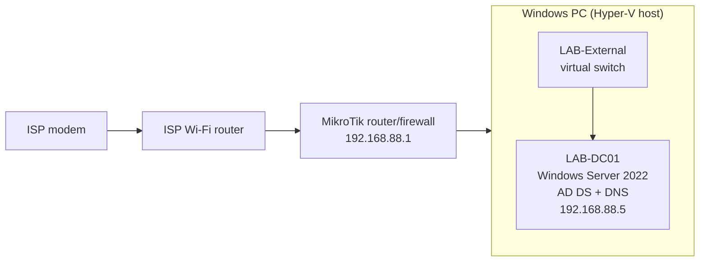

# Hyper-V Active Directory Home Lab

I built a Windows Server 2022 domain controller as a virtual machine in Hyper-V on my Windows PC and connected it to my home network. I'm using this lab to practice the skills entry-level IT roles ask for: Active Directory, DNS, user and group management, and troubleshooting.

> Search this file for `FILL IN` and replace each placeholder with your own details before publishing.

## Status

| Component | Status |
|---|---|
| Hyper-V VM (`LAB-DC01`) | Done |
| Windows Server 2022 installed | Done |
| Static IP configured | Done |
| Active Directory Domain Services + DNS (`lab.local`) | Done, `dcdiag` passes |
| Organizational Units, users, and groups | Done |
| Windows 11 client (`LAB-CLIENT01`) joined to the domain | Done |
| Organizational Units, users, and groups | Planned |
| Group Policy | Planned |
| Ubuntu Server VM | Planned |
| Network isolation (private switch or VLAN) | Planned |

## Architecture

The `LAB-External` virtual switch uses the host PC's network adapter, so the VM sits on the same `192.168.88.0/24` network as my other devices. Because the MikroTik router is connected behind the ISP's router, this network is behind two layers of NAT.
| Client VM name | `LAB-CLIENT01` |
| Client guest OS | Windows 11 Enterprise (Evaluation) |
## Environment

| Item | Value |
|---|---|
| Host OS | FILL IN (for example, Windows 11 Pro) |
| Hypervisor | Hyper-V |
| Host CPU / RAM | FILL IN |
| VM name | `LAB-DC01` |
| VM generation / memory / vCPUs | FILL IN (check the VM's Settings in Hyper-V Manager) |
| Virtual disk | 80 GB, dynamically expanding VHDX |
| Guest OS | Windows Server 2022 Standard Evaluation (Desktop Experience) |
| Domain | `lab.local` (NetBIOS name `LAB`) |
| DC IP address | `192.168.88.5/24` |
| Default gateway | `192.168.88.1` |
| DNS server on the DC | `192.168.88.5` (itself) |
| Virtual switch | `LAB-External` (external) |

## Documentation

- [Build steps](docs/01-build-steps.md): how I built the lab from an empty Hyper-V host to a healthy domain controller
- [Lab 2: Windows client VM](docs/03-lab2-client-vm.md): building `LAB-CLIENT01` and joining it to `lab.local`
- [Troubleshooting log](docs/02-troubleshooting.md): problems I hit, what caused them, and how I fixed them
- [`scripts/verify-dc.ps1`](scripts/verify-dc.ps1): a PowerShell script that runs the health checks I used to verify the DC

## Skills practiced

- Creating and managing virtual machines in Hyper-V (virtual switches, virtual disks, ISO attachment, boot order, checkpoints)
- Installing and configuring Windows Server 2022
- Configuring a static IP address and planning around an existing DHCP range
- Installing AD DS and promoting a domain controller for a new forest
- Configuring DNS for Active Directory
- Diagnosing problems with `dcdiag`, `nslookup`, `nltest`, and `w32tm`

## Lessons learned

- A domain controller needs a static IP and should use itself for DNS.
- Active Directory depends heavily on DNS and correct time. Many `dcdiag` failures come from one of those two.
- Take a checkpoint after every major milestone so you can roll back.

## Notes

- The Windows Server evaluation license lasts 180 days.
- I did not install the Windows DHCP role, because my MikroTik router already hands out addresses on this network.
- No passwords, license keys, or public IP addresses are stored in this repo.
